# Friendly 🤝

**Automatically find friends within your close network with shared interests.**

Skip the awkward conversations and get straight into deep conversations about shared passions that go deeper than "how was your day?"

## How It Works

1. **Connect** — Sync your Instagram account
2. **Analyze** — AI analyzes your posts, captions, and bio to map your interests
3. **Discover** — See a visual graph of your interests and find people who share them
4. **Connect** — Get AI-generated icebreakers for shared interests

## Tech Stack

### Frontend

- **Next.js** + React + TypeScript
- **Tailwind CSS** + shadcn/ui
- **D3.js** force-directed graph visualization
- **Bun** runtime

### Backend

- **FastAPI** (Python)
- **Neo4j** graph database
- **[Atlas Pipeline](scraper-guide-new.md)** scraper-standalone (Instagram HTTP scraping)
- **UV** package manager

### AI Services

| Service      | Role                                              |
| ------------ | ------------------------------------------------- |
| **Reka**     | Image analysis, icebreaker generation             |
| **Pioneer**  | GLiNER2 zero-shot NER — entity extraction         |
| **Yutori**   | Research & scouting tasks for interest enrichment |
| **Modulate** | Speech-to-text for voice ingestion                |

## Getting Started

### Prerequisites

- Node.js 18+ / Bun
- Python 3.11+
- Docker (for Neo4j)

### Setup

```bash
# Clone
git clone https://github.com/shlawgathon/friendly.git
cd friendly

# Backend
cd backend
cp .env.example .env  # Add your API keys
uv sync
source .venv/bin/activate
uvicorn app.main:app --port 8000 --reload

# Frontend (new terminal)
cd frontend
bun install
bun run dev
```

### Neo4j

```bash
# Local (Docker)
docker compose up neo4j -d

# Or use Neo4j Aura (cloud) — update NEO4J_URI in .env
```

### Environment Variables

```env
# Neo4j
NEO4J_URI=bolt://localhost:7687
NEO4J_USER=neo4j
NEO4J_PASSWORD=your_password

# AI Services
REKA_API_KEY=your_key
PIONEER_API_KEY=your_key
YUTORI_API_KEY=your_key
MODULATE_API_KEY=your_key

# Scraper Standalone
SCRAPER_URL=http://localhost:8090
SCRAPER_API_KEY=your_key
```

### Defaults

| Setting                    | Default                 | Description                                    |
| -------------------------- | ----------------------- | ---------------------------------------------- |
| `MAX_POSTS_PER_INGEST`     | 10                      | Posts scraped per ingestion request            |
| `MAX_POSTS_HARD_LIMIT`     | 25                      | Absolute cap on posts per scrape               |
| `TOP_INTERESTS_FOR_YUTORI` | 3                       | Top interests sent to Yutori for enrichment    |
| `MAX_PARALLEL_REKA_CALLS`  | 2                       | Concurrent Reka image analysis calls           |
| `API_TIMEOUT_SECONDS`      | 20                      | Timeout for external API calls (Pioneer, Reka) |
| `MAX_RETRIES`              | 3                       | Retry count for failed API calls               |
| `INGEST_COOLDOWN_MINUTES`  | 5                       | Cooldown between re-ingesting the same user    |
| `SCRAPER_URL`              | `http://localhost:8090` | scraper-standalone service URL                 |

### Pioneer Entity Labels

The Pioneer GLiNER2 NER model extracts the following entity types from combined caption/bio text:

`hobby` · `location` · `brand` · `activity` · `sport` · `food` · `music` · `art`

Threshold: `0.5` (configurable per call)

## Architecture


### Ingestion Pipeline

```mermaid
flowchart TD
    A["POST /api/ingest/instagram"] --> B["Scrape via scraper-standalone"]
    B --> C["Profile + Posts + Reels"]
    C --> D["Reka Vision — analyze images"]
    C --> E["Collect captions + bio text"]
    D --> F["Combined text corpus"]
    E --> F
    F --> G["Pioneer GLiNER2 — extract entities"]
    G --> I["Write entities to Neo4j"]
    I --> J["Yutori — research & scouting tasks"]
    J --> K["Job complete ✓"]
```



## License

MIT
